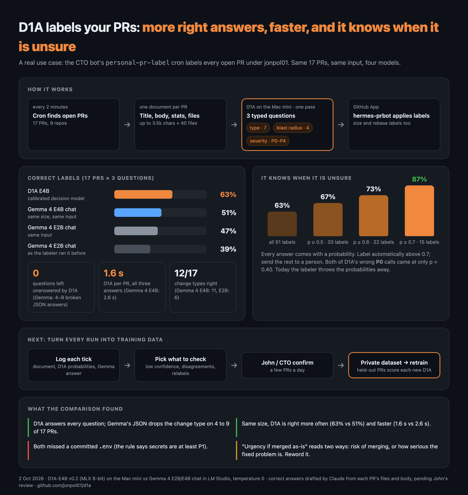

# D1A

[](https://github.com/jonpol01/d1a/actions/workflows/ci.yml)
[](https://github.com/jonpol01/d1a/actions/workflows/license.yml)
[](https://github.com/jonpol01/d1a/releases)
[](LICENSE)
[](pyproject.toml)
[](https://huggingface.co/JohnP1/d1a-e4b)
[](https://huggingface.co/JohnP1/d1a-e4b-mlx-q8)
[](https://github.com/jonpol01/d1a-playground)

**A small decision model on Gemma 4.** One document and a set of typed questions in, a calibrated probability for every option out, in one forward pass. No text generation.

**It learns from what actually happened.** D1A logs every decision; when the real outcome comes back (the tests passed, a maintainer corrected the label), it recalibrates, retrains and promotes a new version only if a held-out gate says it is better. See [Self-Learning](#self-learning-d1a-learns-from-outcomes).

> **Built on Kev.** D1A is built on [Kev](https://github.com/jaredpalmer/kev) by Jared Palmer, licensed under the [Apache License 2.0](LICENSE). The model code, trainer, benchmark and frozen evaluation suites here started as a copy of Kev (upstream commit `0fe8fc9`); [docs/UPSTREAM.md](docs/UPSTREAM.md) lists every file taken from Kev and what D1A changed. D1A is an independent project. It is not affiliated with, sponsored by or endorsed by Jared Palmer or the Kev authors.

## See It Running

Twelve use cases, each answered by D1A in one forward pass (recorded live from the [playground](https://github.com/jonpol01/d1a-playground): 1–9 on an M4 Mac mini with MLX 8-bit, 10–11 through [`d1a.media`](#photos-voice-and-video) on an M1 Max, 12 on the Mac mini's D1A-E4B v0.2):

<table>
<tr><td align="center" width="33%"><br><b>1. Model routing</b></td><td align="center" width="33%"><br><b>2. Guardrails</b></td><td align="center" width="33%"><br><b>3. Tool-call gating</b></td></tr>
<tr><td align="center" width="33%"><br><b>4. Inbox triage</b></td><td align="center" width="33%"><br><b>5. Reranking</b></td><td align="center" width="33%"><br><b>6. LLM evals</b></td></tr>
<tr><td align="center" width="33%"><br><b>7. Bulk labeling</b></td><td align="center" width="33%"><br><b>8. Real-time control</b></td><td align="center" width="33%"><br><b>9. Confidence gate</b></td></tr>
<tr><td align="center" width="33%"><br><b>10. Photo check</b></td><td align="center" width="33%"><br><b>11. Voice triage</b></td><td align="center" width="33%"><br><b>12. PR labeler</b></td></tr>
</table>

## What It Is

D1A answers yes/no, multiple-choice and rating questions about a piece of text, the way an API call answers a function: routing a support ticket, gating an agent's tool call, triaging an inbox, ranking passages, grading an LLM's answer. Every answer comes with probabilities, so your code can act on the confident cases and send the rest to a person.

A causal LM backbone with a LoRA adapter runs one prefill pass over the document and the questions under a block-causal mask (each question sees the document and itself, never the other questions). A small pointer head scores each option's end token against the question's `<decide>` token, and a softmax turns the scores into probabilities. D1A's backbones are Gemma 4 E2B and E4B; the Qwen bases Kev was built for still work. It speaks the TypeSafe System One API (`POST /v1/systemone`), so the TypeSafe SDK and existing clients work against it.

## How It Works

**1. The input.** The document comes first, once. Each question follows as its own branch: `<q>` and the instructions, one `<opt> … </opt>` span per option, then `<decide>`. On Gemma 4 the five delimiters are the reserved tokens `<unused0>`–`<unused4>`, which user text cannot produce. Position ids restart after the document for every question, so each question sees exactly what it would see alone.

<picture>
  <source media="(prefers-color-scheme: dark)" srcset="docs/arch/layout-dark.svg">
  , the options and <decide>" width="100%">
</picture>

**2. The model.** A Gemma 4 backbone with a LoRA adapter, and a small pointer head. The head turns the hidden state at `<decide>` into a query and the hidden state at each `</opt>` into a key; their scaled dot products are the option scores. Dividing by a temperature fitted on held-out data makes the probabilities calibrated without changing the top answer.

<picture>
  <source media="(prefers-color-scheme: dark)" srcset="docs/arch/model-dark.svg">
  
</picture>

**3. Two ways to run it, same answers.** *Packed* runs the whole request as one sequence under a block-causal mask. *Rows* reads the document once into a prefix cache, then runs each question as its own short row. Short requests run packed; long documents, cached documents, hybrid backbones and the MLX path run as rows. A test checks that both agree.

<picture>
  <source media="(prefers-color-scheme: dark)" srcset="docs/arch/forms-dark.svg">
  
</picture>

**4. Where it runs.** `d1a.serve` speaks the System One API, on MLX on Apple Silicon and on PyTorch elsewhere. The same server and the same model answer about a photo, a voice note or a video: Gemma 4's own vision and audio encoders turn the media into tokens the model reads, so there is no captioning or speech-to-text step, and `--idle-unload` frees the memory when nobody is asking ([Photos, Voice and Video](#photos-voice-and-video)).

<picture>
  <source media="(prefers-color-scheme: dark)" srcset="docs/arch/serving-dark.svg">
  
</picture>

**5. Learning from outcomes.** Every decision is logged with the model that made it (`d1a.feedback.FeedbackLog`). When the outcome is known, three steps run, cheapest first: an `OutcomeCalibrator` refits each yes/no probability on the outcomes (Platt scaling, which also corrects a shifted base rate), a small LoRA update trains on the resolved decisions, and `gate()` promotes the candidate only if its held-out log loss is lower with a 95% bootstrap interval clear of zero and no frozen suite regressed. A promoted candidate becomes the next version through `d1a.versions`.

<picture>
  <source media="(prefers-color-scheme: dark)" srcset="docs/arch/learning-dark.svg">
  
</picture>

The diagrams are generated by [`docs/arch/make_svgs.py`](docs/arch/make_svgs.py).

## In Production: PR Labeling

D1A's first everyday job: a scheduled job labels every open pull request in jonpol01's repositories with D1A on a Mac mini. One request per PR (title, description, stats and changed files) answers three typed questions at once: change type (7), blast radius (4) and severity (P0–P4). Answers below p 0.7 add `review:needs-human`.

On the same 17 PRs and the same input, D1A-E4B got 63% of the labels right against 51% for Gemma 4 E4B chat (39% for the Gemma 4 E2B setup it replaced), answered every question where the chat models' JSON dropped some, and took 1.6 s per PR. Above p 0.7 it was right 87% of the time. Since then D1A-E4B **v0.3** has been fine-tuned for the job on 3,500 English and 768 Japanese pull requests labeled with the same taxonomy (one L4 GPU, $2.34), and the Mac mini now serves it. On 953 held-out PRs it gets 78% of the labels right (v0.2: 50%), and 93% of those it gives at p ≥ 0.7, which is 57% of them; on 92 Japanese PRs 70% (v0.2: 40%). Blast radius stays the weak label (54%). A second round, **v0.4** (4,063 more English PRs and 2,185 more with a blast-radius label, $3.77), raised that to 81% (severity 70% → 78%, Japanese 74%, the 17 real PRs 61% → 69%), confident on 65% of labels, at a cost of 1–3 points on D1A's other skills; the Mac mini now serves v0.4. The data steps, training job and scoring scripts are in [`recipes/pr-labeler`](recipes/pr-labeler). Try it in the [playground](https://github.com/jonpol01/d1a-playground) (demo 12).



## Self-Learning: D1A Learns From Outcomes

Most of D1A's decisions get a ground truth later: a patch passes or fails its tests, a maintainer keeps or corrects a label, a routed task succeeds or fails. `d1a.feedback` turns those outcomes into a better model without letting a worse one through.

```python
from d1a import D1A
from d1a.feedback import FeedbackLog

m, log = D1A.load("JohnP1/d1a-e4b-mlx-q8"), FeedbackLog("runs/feedback/verifier.jsonl")
q = {"resolved": {"type": "noul", "instr": "Does this patch fix the issue?"}}
answers = m.decide(issue_and_patch, q)
did = log.decision(issue_and_patch, q, answers, run="JohnP1/d1a-e4b-mlx-q8@v0.4")
...                                     # later, when the tests have run
log.outcome(did, {"resolved": True})
```

```bash
python -m d1a.feedback status runs/feedback/verifier.jsonl                       # outcomes, base rate, log loss
python -m d1a.feedback calibrate runs/feedback/verifier.jsonl --out cal.json     # minutes: refit P on outcomes
python -m d1a.feedback records runs/feedback/verifier.jsonl --out feedback.jsonl # data for a small LoRA update
```

**As a service.** `d1a.serve` runs the loop for any client: with `D1A_FEEDBACK_LOG` set, every answer carries a `decision_id` and is logged, and `POST /v1/feedback` records what actually happened; with `D1A_OUTCOME_CALIBRATOR` set, yes/no answers go through the latest calibrator, re-read whenever the file changes, so recalibrating needs no restart.

```bash
D1A_FEEDBACK_LOG=runs/feedback/verifier.jsonl D1A_OUTCOME_CALIBRATOR=runs/feedback/cal.json \
  uv run --extra serve python -m d1a.serve --run JohnP1/d1a-e4b-mlx-q8@v0.4 --port 8009
curl -s localhost:8009/v1/feedback -H 'content-type: application/json' \
  -d '{"decision_id": "<from the answer>", "labels": {"resolved": true}}'
python -m d1a.feedback calibrate runs/feedback/verifier.jsonl --out runs/feedback/cal.json   # picked up on the next request
```

`gate()` decides whether the retrained candidate replaces the current model: lower held-out log loss with a 95% bootstrap interval (over repositories, for example) entirely below zero, and no frozen suite more than a point worse. Otherwise the current model stays.

**Measured first on a coding-agent verifier**: D1A-E4B reads an issue, an agent's patch and the end of its run, and answers "does this patch resolve the issue?", tested on 921 agent runs from 83 repositories it never saw (public SWE-agent runs, [nebius/SWE-agent-trajectories](https://huggingface.co/datasets/nebius/SWE-agent-trajectories), CC-BY-4.0):

| | Ranking (AUROC) | Calibration error (ECE) |
|---|---|---|
| D1A-E4B v0.4, before any outcomes | 0.742 | 0.632 |
| recalibrated on outcomes (Platt) | 0.742 | 0.043 |
| trained on outcomes (LoRA, 800 runs, 2.5 h on a Mac) | **0.807** | **0.039** |
| trajectory heuristics, for comparison | 0.768 | 0.019 |

Trained on outcomes, it also picks better training data for an agent: the 10% of runs it trusts most are 40% truly resolved, against 23% for the heuristics.

**The loop, run for three rounds** (300 new outcomes each, the verifier measured on test repositories after every round, [#119](https://github.com/jonpol01/d1a/issues/119)):

| Round | Outcomes | Calibration error (ECE) | Gate on the retrained candidate |
|---|---|---|---|
| 0 | 0 | 0.068 | – |
| 1 | 300 | 0.036 | rejected: clearly worse (log loss +0.026, 95% CI +0.016..+0.058) |
| 2 | 600 | **0.017** | rejected: not clearly better (+0.010, CI −0.004..+0.050) |
| 3 | 900 | 0.031 | rejected: not clearly better (−0.007, CI −0.016..+0.014) |

Recalibration on outcomes works at once and needs no restart. Small retraining rounds have not yet produced a model that is clearly better, and the gate has kept every one that was not, so the loop has never shipped a regression. Ranking runs of the *same* issue against each other remains hard: on 119 issues with mixed outcomes, D1A reaches within-issue AUROC 0.64 against 0.62 for cheap trajectory heuristics, a difference within noise.

## What Works Today

| | |
|---|---|
| Training and serving on Gemma 4 E2B / E4B (and Qwen) | yes, this repo |
| D1A-E2B (Gemma 4 E2B) | [JohnP1/d1a-e2b](https://huggingface.co/JohnP1/d1a-e2b) `v0.2` (2 epochs, calibrated); `v0.1` (1 epoch) |
| D1A-E2B for Apple Silicon (MLX, 8-bit) | [JohnP1/d1a-e2b-mlx-q8](https://huggingface.co/JohnP1/d1a-e2b-mlx-q8) `v0.2` (3.0 GB in memory) |
| D1A-E4B v0.4 (Gemma 4 E4B: pull-request labeling, two rounds, English and Japanese) | [JohnP1/d1a-e4b](https://huggingface.co/JohnP1/d1a-e4b) `v0.4`, the best PR labeler: PR labels 81% (Japanese 74%). `v0.3` (PR labels 78%) is 1–3 points better on general, Japanese and routing questions; `v0.2` (Kev's later stages + Japanese + agent routing) and `v0.1` stay available |
| D1A-E4B for Apple Silicon (MLX, 8-bit) | [JohnP1/d1a-e4b-mlx-q8](https://huggingface.co/JohnP1/d1a-e4b-mlx-q8) `v0.4` (~6 GB, plus 1 GB of photo, voice and video encoders; what the Mac mini playground serves) |
| Live demos of twelve use cases (two from a photo or a voice note, one labeling pull requests) | [jonpol01/d1a-playground](https://github.com/jonpol01/d1a-playground) |
| Thin clients (Python, JS) | [`clients/`](clients) |

Model versions: one Hugging Face repository per size and format, and one tag per version (`v0.1`, `v0.2`, `v0.3`, `v0.4`, ...); each version continues training the one before it, and its model card lists what it was trained on. Load a version as `JohnP1/d1a-e4b@v0.3`. Older tag names (`v0.2-hybrid`, `v0.2-2epoch`, ...) still work.

## Quick Start

You need Python 3.12 or 3.13 and [uv](https://docs.astral.sh/uv/).

```bash
git clone https://github.com/jonpol01/d1a.git && cd d1a
uv sync --extra serve
uv run --extra serve python -m d1a.serve --run JohnP1/d1a-e2b --port 8009
```

This serves the prototype checkpoint: CUDA if you have a GPU, MLX on Apple Silicon (`D1A_BACKEND=torch` for PyTorch MPS; see [Apple Silicon (MLX)](#apple-silicon-mlx)). The first run downloads the adapter and the base model. `--run` also takes a local checkpoint directory or a Hub revision (`repo@rev`). Once the D1A weights are published, `--run JohnP1/d1a-e2b` serves them the same way.

Send it a ticket:

```bash
curl -s localhost:8009/v1/systemone -H 'content-type: application/json' -d '{
  "state": "Shoes arrived two weeks late and in the wrong size. Also I see two charges on my card.",
  "model": "d1a-latest",
  "questions": {
    "team":   {"type": "choice", "instructions": "Which team should handle this?",
               "criteria": {"returns": null, "shipping": null, "billing": null}},
    "urgent": {"type": "noul", "instructions": "Does this need a reply today?"}
  }
}'
```

### The System One API

`POST /v1/systemone` takes a `state` (the document), a `model` name and up to many `questions`, each a `noul` (yes/no), `choice` (one of named options) or `score` (an ordered scale). The response has one answer per question with a probability per option, plus token usage and latency. `GET /v1/models` lists the accepted model names with the serving details, including load: requests and batches served, the queue, prefix-cache hits and the recent batches' model time (p50, p95, max). `GET /metrics` reports the same in Prometheus text format (plus memory), for a scraper; like `/v1`, it needs the bearer key when `D1A_API_KEY` is set.

Model names: the server answers any name and lists `d1a-latest`, `kev-latest` and `jev-latest`. `d1a-latest` is D1A's own name. `kev-latest` stays accepted so clients written against Kev keep working unchanged, and `jev-latest` is the TypeSafe SDK's default, so an unconfigured SDK client works too. Set `D1A_API_KEY` to require `Authorization: Bearer <key>`.

With the TypeSafe SDK (included in `uv sync --extra serve`); it reads non-English text too:

```python
from typesafe_sdk import Choice, TypeSafeClient

client = TypeSafeClient(api_key="local", base_url="http://127.0.0.1:8009", model="d1a-latest")
r = client.system_one(
    state="注文した靴が2週間遅れて届き、サイズも間違っていました。",
    questions={"team": Choice(instructions="Which team should handle this?",
                              criteria={"returns": None, "shipping": None, "billing": None})},
)
print(r.choices["team"].choice, r.choices["team"].probabilities)
```

### In Your Own Code (No Server)

Load a checkpoint once and ask questions in-process. Questions and answers use the same shape as the System One API, so code moves between the two unchanged:

```python
from d1a import D1A

m = D1A.load("JohnP1/d1a-e2b-mlx-q8")   # Apple Silicon (MLX, 3.0 GB); JohnP1/d1a-e2b on NVIDIA or CPU
answers = m.decide("Shoes arrived late and I was charged twice.",
                   {"team": {"type": "choice", "instr": "Which team should handle this?",
                             "criteria": {"returns": "returns", "shipping": "shipping", "billing": "billing"}},
                    "urgent": {"type": "noul", "instr": "Is this urgent?"}})
print(answers["team"]["probabilities"], answers["urgent"]["noul"])
```

### From Agents (MCP)

`d1a.mcp_server` gives agents (Hermes, Claude Code, any MCP client) the decisions of an agent factory as tools: `d1a_intake` (a new request: which worker, how large a model, ask the user first?), `d1a_judge` (a card and its latest report: done, blocked, needs a person, next step), `d1a_tier` (small, medium or large model for the implementation), `d1a_gate` (may this tool call run: allow, ask, deny), `d1a_route` (which model size answers a prompt) and `d1a_decide` (your own questions). Each returns the answers with probabilities plus `advice`, an action whose defaults fail safe: unsure answers route up, ask a person, or keep a card open (`d1a.presets.advise`).

```bash
pip install "d1a[mcp] @ git+https://github.com/jonpol01/d1a"
D1A_URL=http://127.0.0.1:8009 python -m d1a.mcp_server        # stdio; asks a running d1a.serve
```

Register it as a stdio MCP server (command `python`, args `-m d1a.mcp_server`, env `D1A_URL`) in the agent's MCP settings, and allow the tool names above. `D1A_RUN=<checkpoint>` loads a model in the MCP process instead of calling a server. The question sets are in `d1a/presets.py`, worded exactly as the routing training data asks them.

### Clients

Dependency-free clients for any System One server live in [`clients/python`](clients/python) (PyPI `d1a-client`, import `d1a_client`) and [`clients/js`](clients/js) (npm `d1a-client`):

```python
from d1a_client import Client

client = Client("http://127.0.0.1:8009")
answer = client.decide("Shoes arrived late and I was charged twice.",
                       {"team": {"type": "choice", "instructions": "Which team should handle this?",
                                 "criteria": {"returns": None, "shipping": None, "billing": None}}})
print(answer["answers"]["team"]["probabilities"])
```

### Photos, Voice and Video

The model server answers questions about an image, a short voice clip or a video with the same model, the same request shape plus a `media` field. On Apple Silicon, serve an MLX build that carries Gemma 4's vision and audio encoders (`media/`, about 1 GB, fetched on the first such request; `JohnP1/d1a-e4b-mlx-q8@v0.3` has them, and `scripts/export_mlx.py --media` adds them to your own export):

```bash
uv run --extra serve --extra media python -m d1a.serve --run JohnP1/d1a-e4b-mlx-q8@v0.4 --port 8009 --idle-unload 600
```

```bash
curl -s localhost:8009/v1/systemone/media -H 'content-type: application/json' -d '{
  "media": {"type": "image", "data": "'"$(base64 -i parcel.jpg)"'"},
  "questions": {"damaged": {"type": "noul", "instructions": "Is the parcel damaged?"}}
}'
```

`--idle-unload 600` drops the model, encoders included, after 10 minutes without a request and loads it again on the next one (2 s for D1A-E4B on an M1 Max); `GET /v1/models` answers either way and says whether it is `loaded`. With a PyTorch checkpoint (NVIDIA, CPU) run `python -m d1a.media --run JohnP1/d1a-e2b --port 8010` instead: it loads the full Gemma 4 model (bf16, about 10 GB for E2B) as its own process, on the first request, and drops it after 10 idle minutes.

`type` is `image` (JPEG, PNG, WebP), `audio` (WAV, FLAC or OGG, up to 30 s; any sample rate) or `video` (MP4, MOV or WebM, up to 32 MB: 16 frames sampled evenly, each read as a timestamped image; the sound track is not used). An optional `state` adds text next to the media. The checkpoints are trained on text only, so this is zero-shot: on a first test ([#78](https://github.com/jonpol01/d1a/issues/78)) D1A-E2B read damage on 6 of 6 delivery photos, the drop-off place on 5 of 6, and the request in 4 of 4 English and Japanese voice notes; on the playground's 10 samples D1A-E4B v0.3 gets damage 5 of 6, place 6 of 6 and the request 4 of 4. Treat it as a demo, not a measured result. Video is read the same way: on single-scene clips made from the sample photos, D1A-E4B v0.3 gives the same answers as for the photo; questions about the order of events ("where is it at the end?") are not reliable yet.

### Playground

The demos above live in [jonpol01/d1a-playground](https://github.com/jonpol01/d1a-playground), a Next.js app that talks to `d1a.serve`. Kev's in-repo developer playground (packed vs separate answers, option permutation, chess) and its label-review page were removed; [docs/removed-tools.md](docs/removed-tools.md) describes them and how to restore them. The server endpoints they used, `/v1/systemone/separate` and `/v1/systemone/permute`, are still there.

### Apple Silicon (MLX)

On Apple Silicon `d1a.serve` runs Gemma 4 checkpoints through MLX (`d1a/mlx_model.py`, mlx-lm 0.31.3): the adapter is merged into the bf16 base at load and every request runs as the state once plus one row per question. `scripts/export_mlx.py` writes that merged model as a folder which loads without the base or the adapter, optionally quantized:

```bash
uv run --extra mlx python scripts/export_mlx.py --run JohnP1/d1a-e2b --out runs/exports/d1a-e2b-mlx-bf16
uv run --extra mlx python scripts/export_mlx.py --run JohnP1/d1a-e2b --q-bits 4 --q-group-size 64 --out runs/exports/d1a-e2b-mlx-4bit
uv run --extra serve python -m d1a.serve --run runs/exports/d1a-e2b-mlx-4bit --port 8009
```

Parity is measured against golden vectors from the fp32 PyTorch path (`scripts/golden_vectors.py`: 209 records, 274 questions: decision-v7 development records, the playground presets and three long-state records). For JohnP1/d1a-e2b on an M1 Max, |Δp| being the largest change of any option's probability in a question:

| | Weights | Max \|Δp\| | Mean \|Δp\| | Argmax flips | Accuracy (dev, fp32 0.811) | ECE (fp32 0.056) |
|---|---|---|---|---|---|---|
| MLX bf16 | 8.7 GB | 0.043 | 0.003 | 5 (all on reference margins under 0.025) | 0.824 | 0.061 |
| MLX 4-bit, group 64, embeddings included | 2.5 GB | 0.363 | 0.054 | 23 | 0.811 | 0.051 |
| MLX 8-bit, per-layer embeddings 4-bit (`--q-bits 8 --q-per-layer-bits 4`) | 3.5 GB | 0.084 | 0.009 | 5 (margins under 0.053) | 0.824 | 0.062 |

The 4-bit export keeps the accuracy but moves individual probabilities too far to stand in for the fp32 model (8% of the answers change), so it is not published. The error comes from the linear layers: with them in bf16 and both embeddings at 4 bits the maximum is 0.089. The mixed export (8-bit linear layers and token embeddings, 4-bit per-layer embeddings, which are half of E2B's weights) stays close to bf16. Process footprint on the M1 Max: 3.1 GB after loading the 4-bit export and 4.2 GB for the mixed one, about 1 GB more after serving, and a 60-question request peaks at 5.3 / 6.4 GB; a 6-question request takes about 0.4 s and a 60-question one about 4.5 s with either.

Gemma 4's per-layer embeddings are read from the weight files per request instead of held in memory (each request needs only its own tokens' rows): the 8-bit E2B export uses 2.96 GB after loading instead of 4.22 GB, E4B 5.37 GB instead of 6.88 GB, with bit-identical probabilities and no slower (the lookup adds about 0.25 ms per pass). `D1A_PLE_FLASH=0` keeps them in memory.

## Training

The D1A recipe on Gemma 4 E2B (one L4 is enough, about 15 GB peak with a bf16 backbone). `google/gemma-4-E2B` at commit `d29ff6b45f081a49ee2733a859c9c9c2d95d1a6f` is the trainer's default base, so `--base` can be left out:

```bash
uv run python -m d1a.train --suite evals/v7/decision-v7 \
    --epochs 2 --lr 1e-4 --batch 4 --accum 2 --dtype bf16 --weights_dtype bf16 --checkpointing 1 \
    --p_none_pair 0.25 --device cuda --out runs/d1a-e2b
```

For E4B pass `--base google/gemma-4-E4B --base_revision <sha>`. To fine-tune on your own data, start from a checkpoint: `--data mine.jsonl --init_from JohnP1/d1a-e2b`. `--data` (in `d1a.benchmark` too) also takes a D1A suite partition, `evals/d1a/<suite>:<partition>`: a dataset pinned to one Hub commit, fetched and checked against its sha256 before use, and refused for training when it is an eval partition (`python -m d1a.suites --help`). To train on several frozen suites in one run, add `--extra_suites evals/hard-v1,evals/devtools-v1` (each suite's own manifest rules apply to its records). For long runs add `--save_every_minutes 30`: a crash then loses at most 30 minutes, and `--resume 1` with the same arguments continues bit for bit. A single non-finite loss or gradient skips its batch instead of ending the run (three in a row still stop it). `python -m d1a.train --help` lists every option. Before you publish or serve a trained checkpoint, write its calibration temperature into it with `python -m d1a.calibrate` (training leaves it at 1.0 on purpose; `d1a.serve` warns and `/v1/models` reports `calibrated: false` until you do).

Score a checkpoint on the frozen suites:

```bash
uv run python -m d1a.benchmark --run runs/d1a-e2b/checkpoint --suite evals/v4/transfer-v4 --out runs/d1a-e2b-transfer
```

The frozen suites (`evals/`) come from Kev. Their manifests and small partitions are in git; partitions over about 10 MB are fetched from Kev's Hugging Face dataset [`jaredpalmer/kev-suites`](https://huggingface.co/datasets/jaredpalmer/kev-suites) on first use and verified by sha256. A few held-out suites name a private mirror and cannot be loaded without access to it. The suites were admitted under Qwen tokenizers, so the trainer re-admits their records under Gemma's tokenizer with each suite's own rule (70 of decision-v7's 12,576 records are dropped).

Gemma's tokenizer has none of the Qwen delimiter tokens, so D1A uses Gemma's reserved `<unused0>`–`<unused4>` tokens and a leading `<bos>`. The sliding-window attention layers get their own copy of the packed mask, and only the text model is loaded.

## Status and Limitations

Reports: [D1A-E4B routing v0.1](docs/reports/2026-10-routing-v0.1.md) ([日本語](docs/reports/2026-10-routing-v0.1.ja.md)): model routing and agent-kit decisions, before and after training, with what the numbers do and do not show.

Early. On the development partitions of decision-v7:

| Model | Base | Accuracy: Trained Sources (dev) | Accuracy: New Sources (dev) |
|---|---|---|---|
| D1A-E4B (JohnP1/d1a-e4b), 2 epochs | Gemma-4-E4B | 0.853 | 0.680 |
| D1A-E2B v0.2 (JohnP1/d1a-e2b), 2 epochs | Gemma-4-E2B | 0.824 | 0.602 |
| D1A-E2B v0.1, 1 epoch | Gemma-4-E2B | 0.794 | 0.569 |
| Kev-0.8B base recipe, 2 epochs (reference) | Qwen3.5-0.8B-Base | 0.817 | 0.622 |

D1A-E4B is the most accurate so far, ahead of Jev (0.845) on sources it trained on and behind it (0.857) on new ones. Two epochs raised the calibration error from 0.040 to about 0.057 on both sizes, which is being looked at. E4B needed half E2B's learning rate (5e-5): at 1e-4 it diverged mid-epoch.

- On one Windows/WSL2 machine with an NVIDIA GPU, PyTorch's fused SDPA attention kernel corrupted memory during Gemma training. Loading the model with eager attention fixed it. If training crashes or produces NaNs there, try eager attention first.
- Options within one question can still influence each other; asking questions together or separately gives the same probabilities, but option order is not irrelevant.
- The benchmark numbers Kev publishes are for Kev's own Qwen checkpoints, not D1A.

## Development

```bash
uv sync --extra serve
uv run python -m pytest tests/test_unit.py tests/test_research.py tests/test_generators.py tests/test_conventions.py \
    tests/test_documents_tools.py tests/test_hard_v1.py tests/test_devtools_v1.py tests/test_breadth_v1.py tests/test_mlx_export.py -q
python scripts/check_license.py          # license and provenance rules (see CONTRIBUTING.md)
```

These suites need no model weights (the tokenizer, about 10 MB, is downloaded from the Hub). `tests/test_model.py`, `tests/test_mlx.py` and `tests/test_api.py` need weights or a running server.

## Releases

D1A's code is versioned with [Semantic Versioning](https://semver.org) and released on [GitHub](https://github.com/jonpol01/d1a/releases); [CHANGELOG.md](CHANGELOG.md) says what changed in each version, and model checkpoints carry their own Hugging Face tags. How to cut a release: [CONTRIBUTING.md](CONTRIBUTING.md#releasing).

## License

Apache-2.0: see [LICENSE](LICENSE) and [NOTICE](NOTICE).

- D1A's code comes from [Kev](https://github.com/jaredpalmer/kev), Copyright 2026 Jared Palmer, Apache-2.0. Files taken from Kev and changed carry a notice at the top; [docs/UPSTREAM.md](docs/UPSTREAM.md) lists them and every change.
- D1A's changes are Copyright 2026 John Soliva, Apache-2.0.
- Gemma 4 is released by Google under Apache-2.0; the Qwen base models are also Apache-2.0. Training datasets have their own licenses.
- Authors: Kev by Jared Palmer ([@jaredpalmer](https://github.com/jaredpalmer)), built with [Devin](https://devin.ai); D1A by John Soliva ([@jonpol01](https://github.com/jonpol01)).
- Credits carried over from Kev: Kev thanks [Archer Hume](https://archerhume.com/posts/jevs-architecture-unmasked) for the architecture write-up, [TypeSafe](https://docs.typesafe.ai/api) for the API design, [Qwen](https://huggingface.co/Qwen/Qwen3.5-9B-Base) for the base models, [3x3xX3N0N](https://github.com/jaredpalmer/kev/issues/8) and [Radexito](https://github.com/Radexito) for their contributions. Related work: [Hydragen](https://arxiv.org/abs/2402.05099), [DeFT](https://arxiv.org/abs/2404.00242), [FIRST](https://arxiv.org/abs/2406.15657).
