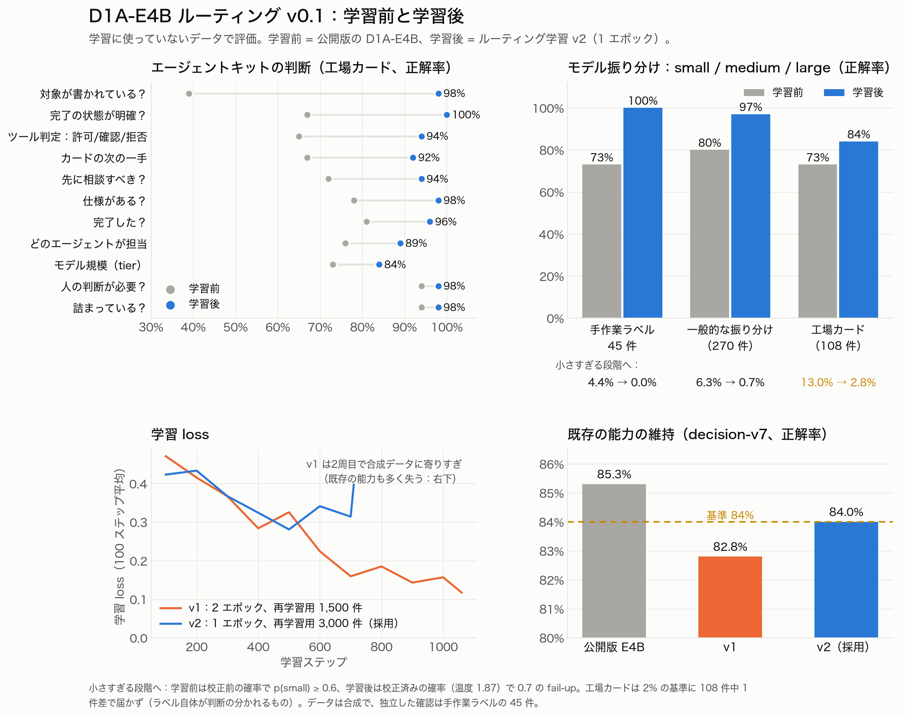

# D1A-E4B ルーティング v0.1：結果と所見

*2026年10月。追跡 issue：[#50](https://github.com/jonpol01/d1a/issues/50)。[English](2026-10-routing-v0.1.md)*

## 何を、なぜ学習したか

D1A の最初の実務ユースケースは、エージェントの「ソフトウェア工場」（SEAOS Hermes エージェントキット）でのモデル振り分けです。各タスクを、こなせる一番小さいモデルに送ります。small は 2〜4B 程度、medium は 9〜30B 程度、large は最先端モデルです。

同じ1回の推論で、キットのほかの判断にも答えます。

- **受付**：どのエージェントが担当するか、対象が書かれているか、仕様があるか、完了の状態が明確か、作業前にユーザーへ相談すべきか。
- **カードの判定**：完了したか、詰まっているか、人の判断が要るか、次に何をするか。
- **ツール呼び出し**：許可・確認・拒否。

学習なしの D1A-E4B でも使えましたが、信頼はできませんでした。振り分けの正解率は 76〜80% で、medium はほぼ半分しか当たらず、6〜8% のプロンプトを小さすぎるモデルに送っていました。段階の説明文の言い回しを変えるだけで答えも変わりました。

`JohnP1/d1a-e4b` @ `v0.1-2epoch` からの LoRA 差分です。合成データ 2,745 件に、decision-v7 の学習データ 3,000 件を再学習用として混ぜ、L4 1枚で 1 エポック（学習率 5e-5）学習しました。

公開先は非公開リポジトリの `JohnP1/d1a-e4b-routing`（タグ `v0.1`）と `JohnP1/d1a-e4b-routing-mlx-q8` です。質問の文言は [`d1a/presets.py`](../../d1a/presets.py) と一字一句同じです。エージェント用のツールは [`d1a/mcp_server.py`](../../d1a/mcp_server.py) にあります。

## 学習前に決めた合格基準

1. medium の正解率が 0.75 以上。
2. fail-up 方針のもとで、小さすぎるモデルに送るのが 2% 以下。
3. エージェントキットのすべての質問で、学習前のモデルを上回る。
4. decision-v7 の開発用データでの正解率が 0.84 以上（既存の能力を保つ）。

どれか一つでも満たさなければ、公開しないと決めていました。

## 結果（学習に使っていないデータ）

| | 学習前 | v1 | **v2（採用）** |
|---|---|---|---|
| decision-v7 開発用データの正解率（0.84 以上） | 0.853 | 0.828 ✗ | **0.840** ✓（ECE 0.026） |
| 手作業でラベル付けした 45 件の振り分け正解率 | 0.73 | 1.00 | **1.00** |
| 一般的な振り分け（270 件）：正解率／小さすぎ | 0.80／6.3% | 0.99／0.4% | **0.97／0.7%** ✓ |
| 工場カードの規模判定（108 件）：medium 正解率／小さすぎ | 0.78／13.0% | 0.90／3.7% | **0.90／2.8%** ✗（1件差） |
| 工場カードの質問（11 問） | 0.39〜0.94 | 0.89〜1.00 | **0.84〜1.00、全問で向上** ✓ |

工場カードで特に伸びたのは次の4つです（学習前 → v2）。

- 対象が書かれているか：0.39 → 0.98
- ツール判定：0.65 → 0.94
- 次の一手：0.67 → 0.92
- 先に相談すべきか：0.72 → 0.94

MLX 8-bit 版は GPU 版と 640 件中 637 件で同じ答えを返し、質問ごとの正解率の差は 0.02 以内です。手作業の 45 件では答えが一つも変わりません。

## 数字を引用する前に読んでほしい注意点

**データは合成です。**
- プロンプトもラベルも、モデル（Hermes ボット経由の grok）が書きました。開発用データも同じ生成元です。そのため、そこでの高い点（一般的な振り分けで 0.97）は、生成元が考える「難しさ」を D1A が覚えた分も含みます。
- 独立した確認は、人が手でラベルを付けた 45 件だけです（0.73 → 1.00）。ただし件数は少なく、ラベル付けは1人です。
- チームの実際のカードではまだ測っていません。それが次のステップです（後述）。

**ラベル自体が判断の分かれるもので、残ったミスにもそれが表れています。** v2 は工場カード 108 件中 3 件を小さすぎる段階に送りました。

- 「05:00 の cron を金曜も動かして」はラベルが medium ですが、D1A は small（0.92）と答えました。スケジュール変更は small の定義（「設定値の変更」）にも当てはまります。
- 「ピッキングもうちょい良くできない？現場が遅いって。」というあいまいな一文は、ラベルが large です。本来は先に相談すべき依頼で、受付の判定がいまはそれを拾います。
- 「CS 一次切り分けエージェントを新規で作って」はラベルが large、D1A は medium でした。

つまり 2% の基準に届かなかったのは1件差で、見方によっては差はありません。

**fail-up のしきい値は、確率が校正されているかで変わります。**
- 学習前の「小さすぎ」は、校正されていない確率に `p(small) >= 0.6` を当てた数字です。学習後は、校正済みの確率（温度 1.87、学習ジョブ内で算出）に 0.7 を当てています。
- v2 では、しきい値 0.6 だと工場カードの 4.6% を小さすぎる段階に送りました。0.7 なら 2.8% で、その代わり 9.3% を大きすぎる段階に送ります。
- `d1a.presets.fail_up` の既定値は 0.7 にしました（#55）。
- 正解率の列は最も確率の高い答えで数えているので、温度の影響は受けません。

**v1 は学習しすぎました。**
- 小さな合成データを2周したことで loss が約 0.06 まで下がり、既存の能力をより多く失いました（0.853 → 0.828）。
- v2 では「1周にする」と「再学習用データを2倍にする」の2つを同時に変えました。そのため、それぞれがどれだけ効いたかは分かりません。

**シードによるばらつきは未測定です。** どちらの実行もシードは1つだけです。実行間の 1〜2 ポイント程度の差（例：decision-v7 の 0.840 と 0.828）は、測っていないノイズの範囲内に収まる可能性があります。

**作業手順のミスが2つ見つかり、どちらも直しました。**
- v1 の学習済みの重みは失われました。自動生成されたアダプターの README を Hub が拒否したのに、ジョブがそのまま続いたためです。ジョブスクリプトは README を除外し、アップロードに失敗したら止まるようにしました。
- D1A-E2B v0.2 と D1A-E4B は、校正温度を入れずに公開されていました。学習は意図的に 1.0 のままにする設計で、`scripts/calibrate_checkpoint.py` の手順を飛ばしていたためです。どちらも再公開しました（`v0.2.1-2epoch-calibrated`、`v0.1.1-2epoch-calibrated`）。`d1a.serve` も、校正されていないチェックポイントを読み込むと警告を出すようにしました（#54）。

**ライセンスは確認待ちです。** 学習データ（`JohnP1/d1a-routing`、非公開）は xAI のモデルが書きました。学習用途に関する規約を確認するまで、データセットもこのモデルも非公開のままにします。

## 当面の使い方

まず **シャドーモード** で使ってください。

- エージェントは `d1a_intake`、`d1a_judge`、`d1a_tier`、`d1a_gate` を呼び出します。
- D1A の答えを、実際の判断と並べて記録します。判断そのものは今までどおりエージェントが行います。
- 規模（tier）での振り分けは、実際のカードで確認できてから有効にします。

`advice` はもともと安全側に倒れるように作ってあります。D1A が確信を持てないときは、一つ上の段階に送るか、人に確認するか、カードを閉じずに残します。

## 次にやること

1. シャドーモードで、結果付きの実際の工場カードを集めます。どのモデルがカードを片付けたか、相談に回ったかを記録します。
2. そのカードで再学習し、同じ基準で測り直します。シードは2つにします。
3. xAI の規約を確認し、データセットとモデルを公開できるか決めます。

## 費用

HF Jobs（L4）で約 $2.50 です。内訳は v1 が約 $1.50、v2 が約 $1 です。データ生成は Hermes ボット経由で、ボット側の xAI 枠を使いました。
