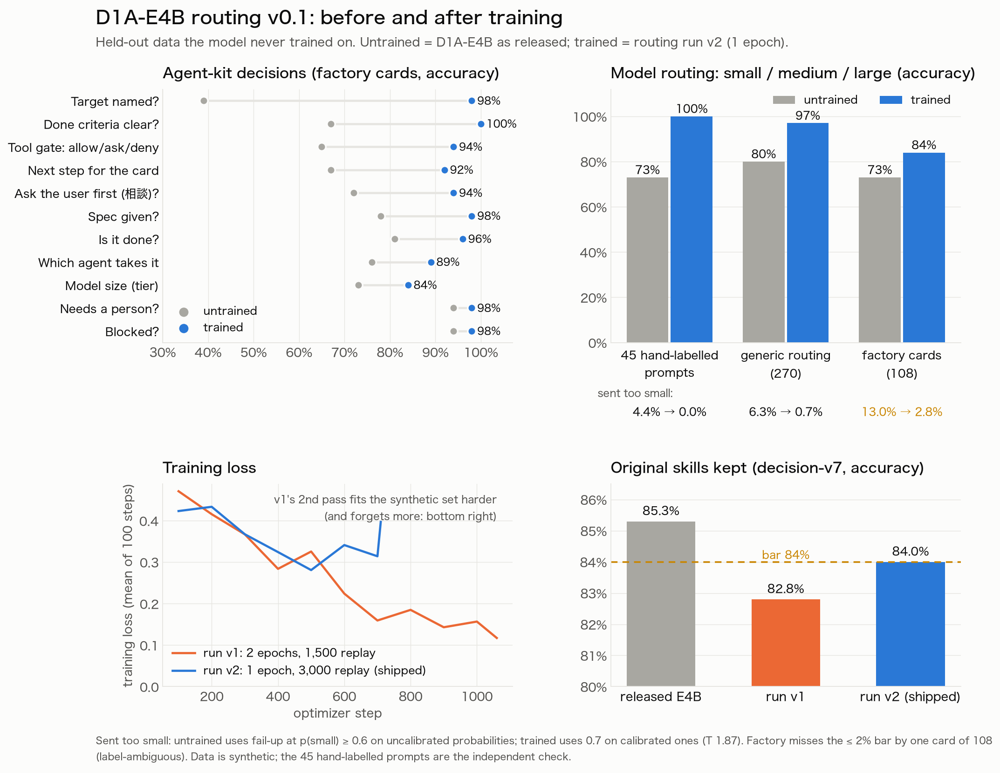

# D1A-E4B routing v0.1: findings

*October 2026. Tracking issue: [#50](https://github.com/jonpol01/d1a/issues/50).*

## What we trained, and why

The first work use case for D1A is model routing in an agent "software factory" (the SEAOS Hermes agent kit): send each task to the smallest model that handles it (small ~2-4B, medium ~9-30B, large = frontier), and answer the kit's other decisions in the same pass: at intake (which agent, is the target named, is the spec given, is "done" clear, should the operator ask the user first), when judging a card (done, blocked, needs a person, next step), and at tool calls (allow, ask, deny).

Zero-shot, D1A-E4B was usable but not reliable: 76-80% routing accuracy, the medium tier right about half the time, 6-8% of prompts sent to a model too small, and answers that moved when the wording of the tier descriptions changed.

The checkpoint is a LoRA delta from `JohnP1/d1a-e4b` @ `v0.1-2epoch`, trained on 2,745 synthetic records mixed with 3,000 replayed decision-v7 training records, for one epoch at lr 5e-5 on one L4. It is published privately as `JohnP1/d1a-e4b-routing` (tag `v0.1`) and `JohnP1/d1a-e4b-routing-mlx-q8`. The questions are worded exactly as in [`d1a/presets.py`](../../d1a/presets.py), and the agent tools are in [`d1a/mcp_server.py`](../../d1a/mcp_server.py).

## The bar, set before training

1. Medium-tier accuracy is at least 0.75.
2. At most 2% of prompts are sent too small under the fail-up policy.
3. Every agent-kit question beats the untrained model.
4. decision-v7 development accuracy stays at or above 0.84, so the released skills hold.

If any of these failed, nothing would be published.

## Results (held-out)

| | untrained | run v1 | **run v2 (shipped)** |
|---|---|---|---|
| decision-v7 development accuracy (>= 0.84) | 0.853 | 0.828 ✗ | **0.840** ✓, ECE 0.026 |
| 45 hand-labelled prompts, routing accuracy | 0.73 | 1.00 | **1.00** |
| generic routing (270): accuracy / sent too small | 0.80 / 6.3% | 0.99 / 0.4% | **0.97 / 0.7%** ✓ |
| factory tier (108): medium accuracy / sent too small | 0.78 / 13.0% | 0.90 / 3.7% | **0.90 / 2.8%** ✗ by one card |
| factory questions (11) | 0.39-0.94 | 0.89-1.00 | **0.84-1.00, every one up** ✓ |

The biggest gains on factory cards (untrained → v2) were: target named 0.39 → 0.98, tool gate 0.65 → 0.94, next step 0.67 → 0.92, and consult first 0.72 → 0.94.

The MLX 8-bit build agrees with the GPU model on 637 of 640 factory answers, and per-question accuracy stays within 0.02. It changes none of the 45 hand-labelled answers.

## Nuances, read before quoting the numbers

**The data is synthetic.**
- A model (grok, through a Hermes bot) wrote both the prompts and their labels, and the development splits come from the same generator. A high score there (0.97 generic) partly means D1A learned the generator's idea of difficulty.
- The independent check is the 45 prompts labelled by hand: 0.73 → 1.00. That set is small and was labelled by one person.
- None of this has been measured on the team's real cards yet. That is the next step (see below).

**The labels are judgement calls, and that shows in the remaining misses.** v2 sends 3 of 108 factory cards too small:
- "Make the 05:00 cron also fire on Fridays" is labelled medium. D1A said small (0.92), and a schedule change fits the small tier's own definition ("a config value").
- A vague one-liner ("can't picking be improved a bit? the floor says it's slow") is labelled large. The right action is to consult first, which intake now catches.
- "Create a new CS triage agent" is labelled large, and D1A said medium.

So the 2% bar is missed by a single card, and arguably by none.

**Fail-up thresholds depend on calibration.** The untrained "sent too small" rates use `p(small) >= 0.6` on uncalibrated probabilities. The trained ones use 0.7 on calibrated probabilities (temperature 1.87, fitted in the training job). At 0.6, v2 sends 4.6% of factory cards too small; at 0.7 it sends 2.8%, with 9.3% sent too large. The default in `d1a.presets.fail_up` is now 0.7 (#55). Accuracy columns are argmax, so the temperature does not affect them.

**Run v1 over-fitted.** Two passes over a small synthetic set drove its loss to about 0.06, and it forgot more of the released skills (0.853 → 0.828). Run v2 changed two things together: one pass, and twice the replay. It is therefore not known how much each change contributed on its own.

**There is no seed variance.** Each run is a single seed. Differences of about 1-2 points between runs (e.g. medium 0.90 vs 0.90, decision-v7 0.840 vs 0.828) are within the noise we would expect and have not measured.

**Two process mistakes surfaced, both fixed.**
- Run v1's trained weights were lost: the Hub rejected the auto-generated adapter README, and the job carried on. Job scripts now skip README files and stop on a failed upload.
- D1A-E2B v0.2 and D1A-E4B had been published without their calibration temperature. Training leaves it at 1.0 on purpose, and the `scripts/calibrate_checkpoint.py` step had been skipped. Both are re-published (`v0.2.1-2epoch-calibrated`, `v0.1.1-2epoch-calibrated`), and `d1a.serve` now warns about an uncalibrated checkpoint (#54).

**The licence is pending.** The training data (`JohnP1/d1a-routing`, private) was written by an xAI model. Until its terms on training use are checked, the dataset and this checkpoint stay private.

## How to use it now

Run it in **shadow mode**: the agents call `d1a_intake`, `d1a_judge`, `d1a_tier` and `d1a_gate`, log D1A's answers next to what they actually did, and keep deciding as before. Route on its tier only once real cards confirm it. The fail-safe `advice` already leans the safe way: an unsure model routes up, asks a person, or keeps a card open.

## Next

1. Collect real factory cards with outcomes in shadow mode: which model finished the card, and whether it went to 相談.
2. Retrain on those cards and re-measure against the same bar, with two seeds.
3. Check the xAI terms, then decide whether the dataset and model can be made public.

## Cost

About $2.50 on HF Jobs (L4): v1 about $1.50, v2 about $1. The data was generated through a Hermes bot on its own xAI quota.
